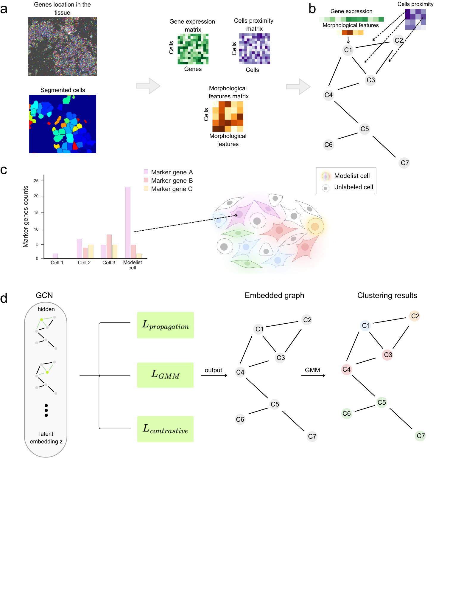

# ModelistsGCN: A Multimodal Graph Convolutional Network Framework for Single-Cell Spatial Transcriptomic Cell Typing
---

Noa Konforti, Tal Goldberg*, Michal Danino*, Shahar Alon

---

---

## Overview

ModelistsGCN is a semi-supervised graph neural network for clustering cells in single-cell spatial transcriptomics data.
It integrates gene expression, spatial proximity, morphological features, and leverages a small set of marker-based "modelist" cells for guidance.

---

## Requirements

ModelistsGCN requires Python ≥ 3.10 and the following main dependencies:

- numpy  
- pandas  
- scipy  
- scikit-learn  
- torch  
- torch-geometric  

Install locally:

pip install ModelistsGCN

---

## Tutorial 
A step-by-step tutorial is available here: [tutorial/tutorial.ipynb](tutorial/tutorial.ipynb)

---

## Data availability

The dataset used in the tutorial is publicly available on Zenodo:  
https://doi.org/10.5281/zenodo.18651041

The tutorial notebook automatically downloads and extracts the data.
